# K-Means Clustering
Implementation of K-Means Clustering algorithm using python


## Dataset
CIFAR-10, contains 60000 32x32 images, where 50000 are used for training 


To find out more about the dataset: <https://www.cs.toronto.edu/~kriz/cifar.html>


Directory of data-set 
```
/cifar-10-batches-py
```


## How To Run The Progam
1. Run main.py
2. Enter the value of k
3. Enter the number of iterations
4. Wait for the program to complete


## Output
Ouptut of the run is generated in 
```
/output/iterations= xx, k= xx/run_id=x
```
It contains:
1. Centroids and samples from each cluster
2. Distortion measure graph
3. Excel sheet containing accuracy fit data

### Sample Output When K= 10 and Iterations= 30

#### Centroids and Samples From Each Cluster
##### Centroids from Cluster 0
 
 

 
 
##### Samples from Cluster 0
 
 
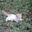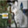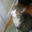
 
 
##### Centroids from Cluster 1
 
 

 

##### Samples from Cluster 1
 
 
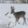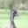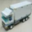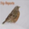
 
 
##### Centroids from Cluster 2
 
 

 
 
##### Samples from Cluster 2
 
 
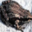
 
 
##### Centroids from Cluster 3
 
 

 
 
##### Samples from Cluster 3
 
 
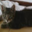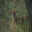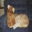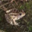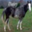
 
 
##### Centroids from Cluster 4
 
 

 
 
##### Samples from Cluster 4
 
 
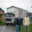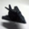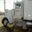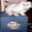
 
 
##### Centroids from Cluster 5
 
 
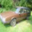
 
 
##### Samples from Cluster 5
 
 
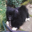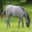
 
 
##### Centroids from Cluster 6
 
 
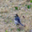
 
 
##### Samples from Cluster 6
 
 
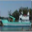
 
 
##### Centroids from Cluster 7
 
 
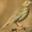
 
 
##### Samples from Cluster 7
 
 
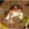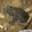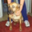
 
 
##### Centroids from Cluster 8
 
 
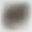
 
 
##### Samples from Cluster 8
 
 
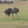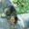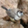
 
 
##### Centroids from Cluster 9
 
 

 
 
##### Samples from Cluster 9
 
 
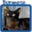

#### Distortion Graph
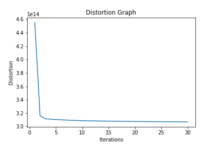
#### Accuracy measure 
To obtain this accuracy measure results are compared to ground truth
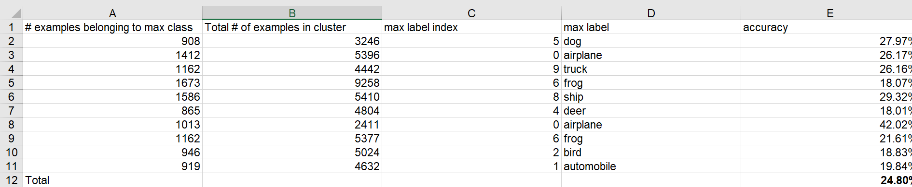
 
